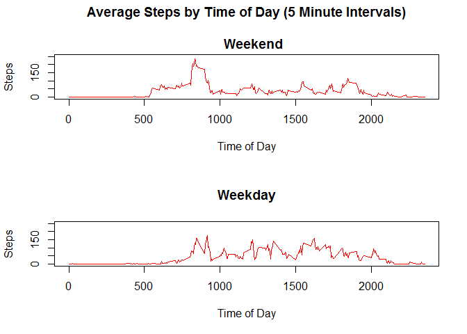

# Reproducible Research: Peer Assessment 1
Daniel A Stearns  
`r format(Sys.time(), '%B %d, %Y')`  

## Loading and preprocessing the data
#### 1. Load Libraries

```r
library(data.table)
```

```
## Warning: package 'data.table' was built under R version 3.2.4
```

```r
library(chron)
```

```
## Warning: package 'chron' was built under R version 3.2.2
```

#### 2. Load the data 

```r
if(!file.exists('activity.csv')){
    unzip('activity.zip')
}

src_data <- read.csv("activity.csv")
```
#### 3. Review and the data set

```r
names(src_data)
```

```
## [1] "steps"    "date"     "interval"
```

```r
str(src_data)
```

```
## 'data.frame':	17568 obs. of  3 variables:
##  $ steps   : int  NA NA NA NA NA NA NA NA NA NA ...
##  $ date    : Factor w/ 61 levels "2012-10-01","2012-10-02",..: 1 1 1 1 1 1 1 1 1 1 ...
##  $ interval: int  0 5 10 15 20 25 30 35 40 45 ...
```

```r
summary(src_data)
```

```
##      steps                date          interval     
##  Min.   :  0.00   2012-10-01:  288   Min.   :   0.0  
##  1st Qu.:  0.00   2012-10-02:  288   1st Qu.: 588.8  
##  Median :  0.00   2012-10-03:  288   Median :1177.5  
##  Mean   : 37.38   2012-10-04:  288   Mean   :1177.5  
##  3rd Qu.: 12.00   2012-10-05:  288   3rd Qu.:1766.2  
##  Max.   :806.00   2012-10-06:  288   Max.   :2355.0  
##  NA's   :2304     (Other)   :15840
```

```r
head(src_data)
```

```
##   steps       date interval
## 1    NA 2012-10-01        0
## 2    NA 2012-10-01        5
## 3    NA 2012-10-01       10
## 4    NA 2012-10-01       15
## 5    NA 2012-10-01       20
## 6    NA 2012-10-01       25
```

```r
tail(src_data)
```

```
##       steps       date interval
## 17563    NA 2012-11-30     2330
## 17564    NA 2012-11-30     2335
## 17565    NA 2012-11-30     2340
## 17566    NA 2012-11-30     2345
## 17567    NA 2012-11-30     2350
## 17568    NA 2012-11-30     2355
```
#### 4. Preprocess the data

```r
src_data$date <- as.Date(as.character(src_data$date),format="%Y-%m-%d")

data <- data.table(src_data)
data <- data[, weekday := weekdays(as.Date(date))]
data <- data[, daytype := ifelse(is.weekend(data$date), "Weekend", "Weekday") ]

data_day <- data[, list(steps = sum(steps, na.rm = T)), by = date]
data_int <- data[, list(steps = mean(steps, na.rm = T)), by = interval]
data_cleansing_strategy <- data[, list(mean_steps = mean(steps, na.rm = T)), by =  list(interval,weekday)]
tables()
```

```
##      NAME                      NROW NCOL MB
## [1,] data                    17,568    5  1
## [2,] data_cleansing_strategy  2,016    3  1
## [3,] data_day                    61    2  1
## [4,] data_int                   288    2  1
##      COLS                                KEY
## [1,] steps,date,interval,weekday,daytype    
## [2,] interval,weekday,mean_steps            
## [3,] date,steps                             
## [4,] interval,steps                         
## Total: 4MB
```

## What is mean total number of steps taken per day?
#### 1. Display Total Steps per Data

```r
data_day
```

```
##           date steps
##  1: 2012-10-01     0
##  2: 2012-10-02   126
##  3: 2012-10-03 11352
##  4: 2012-10-04 12116
##  5: 2012-10-05 13294
##  6: 2012-10-06 15420
##  7: 2012-10-07 11015
##  8: 2012-10-08     0
##  9: 2012-10-09 12811
## 10: 2012-10-10  9900
## 11: 2012-10-11 10304
## 12: 2012-10-12 17382
## 13: 2012-10-13 12426
## 14: 2012-10-14 15098
## 15: 2012-10-15 10139
## 16: 2012-10-16 15084
## 17: 2012-10-17 13452
## 18: 2012-10-18 10056
## 19: 2012-10-19 11829
## 20: 2012-10-20 10395
## 21: 2012-10-21  8821
## 22: 2012-10-22 13460
## 23: 2012-10-23  8918
## 24: 2012-10-24  8355
## 25: 2012-10-25  2492
## 26: 2012-10-26  6778
## 27: 2012-10-27 10119
## 28: 2012-10-28 11458
## 29: 2012-10-29  5018
## 30: 2012-10-30  9819
## 31: 2012-10-31 15414
## 32: 2012-11-01     0
## 33: 2012-11-02 10600
## 34: 2012-11-03 10571
## 35: 2012-11-04     0
## 36: 2012-11-05 10439
## 37: 2012-11-06  8334
## 38: 2012-11-07 12883
## 39: 2012-11-08  3219
## 40: 2012-11-09     0
## 41: 2012-11-10     0
## 42: 2012-11-11 12608
## 43: 2012-11-12 10765
## 44: 2012-11-13  7336
## 45: 2012-11-14     0
## 46: 2012-11-15    41
## 47: 2012-11-16  5441
## 48: 2012-11-17 14339
## 49: 2012-11-18 15110
## 50: 2012-11-19  8841
## 51: 2012-11-20  4472
## 52: 2012-11-21 12787
## 53: 2012-11-22 20427
## 54: 2012-11-23 21194
## 55: 2012-11-24 14478
## 56: 2012-11-25 11834
## 57: 2012-11-26 11162
## 58: 2012-11-27 13646
## 59: 2012-11-28 10183
## 60: 2012-11-29  7047
## 61: 2012-11-30     0
##           date steps
```
#### 2. Plot Historgram of total steps per day

```r
hist(
   data_day$steps, 
   breaks=15, 
   main="Number of Days with Total Steps", 
   xlab="Daily Steps", 
   ylab="Frequency", 
   col="cyan"
)
```

<!-- -->

```r
#barplot(
#    data_day$steps,  
#    names=data_day$date, 
#    main="Total Steps Per Day", 
#    xlab="Dates", 
#    ylab="Steps", 
#    col="cyan", 
#    cex.names=0.6
#)
```

#### 3. Calculate Mean and Median


```r
median_daily_steps <- median(data_day[,steps])
mean_daily_steps <- mean(data_day[,steps])
```

#####Mean: 10395
#####Median:  9354.23

## What is the average daily activity pattern?
#### 1. Time series plot of the interval and steps taken.


```r
plot(
    data_int$interval, 
    data_int$steps, 
    type='l', 
    col="red", 
    main="Average Steps by Time of Day (5 Minute Intervals)", 
    xlab="Time of Day", 
    ylab="Steps"
)
```

<!-- -->


#### 2. Which 5-minute interval, on average across all the days in the dataset, contains the maximum number of steps?

```r
max_step_interval <- data_int[which.max(data_int$steps)]$interval
```

#####Interval with Maximum Steps: 835


## Inputing missing values
#### 1. Calculate Missing Values


```r
total_missing <- sum(is.na(data$steps))
```

#####Total Missing Values: 2304

#### 2. Devise a strategy for filling in all of the missing values in the dataset. The strategy does not need to be sophisticated. For example, you could use the mean/median for that day, or the mean for that 5-minute interval, etc.


```r
data_clean <- data
data_clean <- merge(data_clean, data_cleansing_strategy, by=c("interval","weekday")) 
data_clean <- within(data_clean, steps <- ifelse(is.na(steps), mean_steps, steps))
data_clean <- data_clean[ ,list(date, interval, steps, daytype)]                     
                    

#verify there are no missing values
sum(is.na(data_clean$steps))
```

```
## [1] 0
```

#### 3. Create a new dataset that is equal to the original dataset but with the missing data filled in.


```r
data_clean_day <- data_clean[, list(steps = sum(steps, na.rm = T)), by = date]
```

#### 4. Plot Historgram of total steps per day

```r
hist(
   data_clean_day$steps, 
   breaks=15, 
   main="Number of Days with Total Steps", 
   xlab="Daily Steps", 
   ylab="Frequency", 
   col="cyan"
)
```

<!-- -->

```r
#barplot(
#    data_clean_day$steps,  
#    names=data_clean_day$date, 
#    main="Total Steps Per Day", 
#    xlab="Dates", 
#    ylab="Steps", 
#    col="cyan", 
#    cex.names=0.6
#)
```

#### 3. Calculate Mean and Median


```r
median_clean_daily_steps <- median(data_clean_day[,steps])
mean_clean_daily_steps <- mean(data_clean_day[,steps])
```

#####Mean: 11015
#####Median:  10821.21

####4. Determine impact of imputing missing data.

#####Median Original: 10395 
#####Median Clean: 11015 
#####<span style="color:blue">Median Difference: 620</span>
#####<span style="color:blue">Median Variance: 5.96%</span>

#####Mean Original: 9354.23 
#####Mean Clean: 10821.21 
#####<span style="color:blue">Mean Difference: 1467</span> 
#####<span style="color:blue">Median Variance: 15.68%</span>

Yes, using the cleansing strategy based on average number of steps per interval and weekday causes a statistically significant shift in the median and mean amount of steps, however the imputing of the data creates a more normalized histogram with an even distribution. 


## Are there differences in activity patterns between weekdays and weekends?

#### 1. Create a new factor variable 


```r
date_week <- data_clean
data_week <- data[, list(steps = mean(steps, na.rm = T)), by = list(interval, daytype)]
data_weekday <- data_week[daytype=="Weekend"]
data_weekend <- data_week[daytype=="Weekday"]
```

#### 2. Make a panel plot 


```r
par(mfrow=c(2,1))

plot(
    data_weekend$interval, 
    data_weekend$steps, 
    type='l', 
    col="red",
    main="Average Steps by Time of Day (5 Minute Intervals)

    Weekend",
    xlab="Time of Day", 
    ylab="Steps",
    ylim=c(0, 250)
)

plot(
    data_weekday$interval, 
    data_weekday$steps, 
    type='l', 
    col="red",
    main="Weekday", 
    xlab="Time of Day", 
    ylab="Steps",
    ylim=c(0, 250)
)
```

<!-- -->

#### 3. weekend/Weekday Differences 


```r
summary(data_weekday$steps)
```

```
##    Min. 1st Qu.  Median    Mean 3rd Qu.    Max. 
##   0.000   1.107  32.040  43.080  75.570 175.000
```

```r
summary(data_weekend$steps)
```

```
##    Min. 1st Qu.  Median    Mean 3rd Qu.    Max. 
##   0.000   2.218  23.970  35.340  51.870 234.100
```
